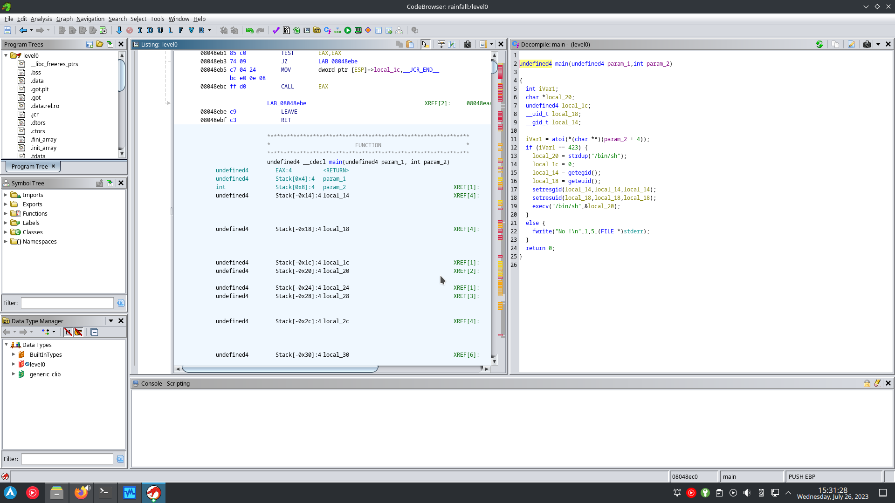
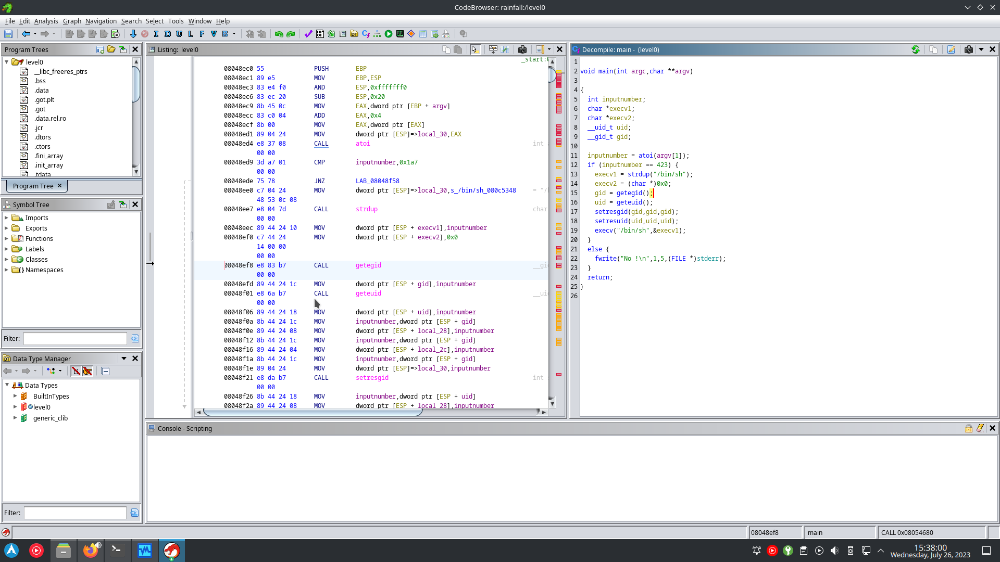

en ouvrant le binaire level0 dans ghidra on peut avoir un bon apercu du code source.

en renomant les data type et nom de variable on peut y voir plus clair,
et comprendre que si on donne 423 en input au programme,
il va execute /bin/sh avec l'utilisateur level1.

de la il suffit de cat le ficher .pass
