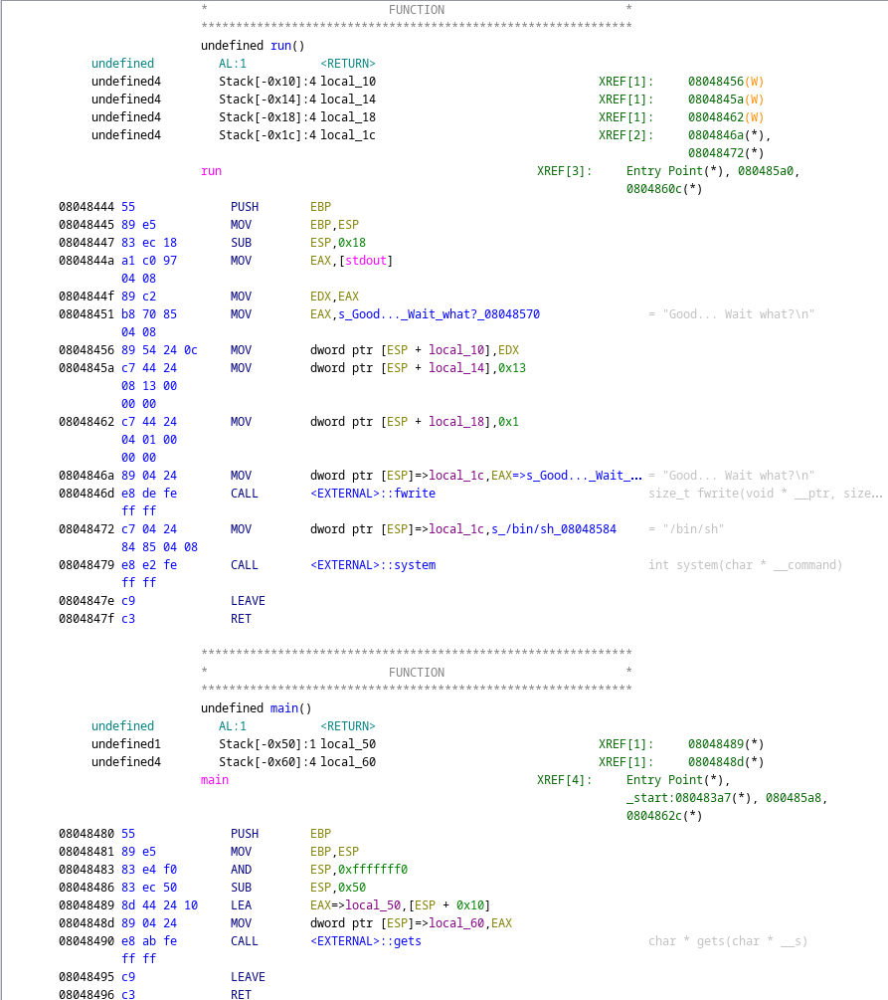

# LEVEL 1

Nous avons acces a un executable, `level1`, en l'executant, nous voyons qu'il attends un input, mais quand on envoie un input, il ne renvoie rien.

En ouvrant l'exécutable avec ghidra, nous voyons ca:


- Une fonction run(qui n'est pas appelée), mais qui execute avec system "/bin/sh".
- Une fonction main

En regardant la fonction main, nous qu'elle utilise la fonction `gets`, qui contient une faille de sécurité, car elle ne vérifie pas la taille de l'input, et donc on peut faire un buffer overflow. Donc faire en sorte que après le main, au lieu de retourner normalement, il execute la fonction run.

Après quelques tests pour connaitre la taille du buffer, on voit qu'il est de 76, donc on va devoir mettre 76 caractères, puis l'adresse de la fonction run, qui est `0x08048444` en little endian.

```bash
python -c "print('42'*38 + '\x44\x84\x04\x08')" | ./level1
Good... Wait what?
Segmentation fault (core dumped)
```

On a donc bien réussi a faire un buffer overflow, mais /bin/sh étant lancé avec `system`, il return directement, donc il faut trouver un moyen de faire en sorte que le programme continue après le `system("/bin/sh")`.
En utilisant `cat`, on peut faire en sorte que le programme continue après le `system("/bin/sh")`.

```bash
(python -c "print('42'*38 + '\x44\x84\x04\x08')";cat) | ./level1
Good... Wait what?
cat /home/user/level2/.pass
53a4a712787f40ec66c3c26c1f4b164dcad5552b038bb0addd69bf5bf6fa8e77
```
