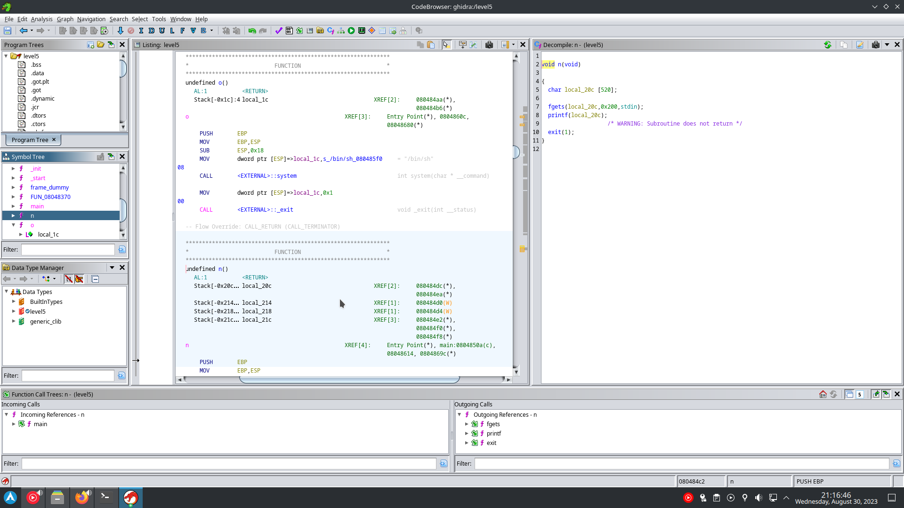

like previous exercise we will use a format string exploit on printf.

this time we need to call the function `o` which calls `/bin/sh`. see `source.c`.
we already used a exploit in `gets` to make the end of a function go to a address in memory, but this time we can't as the function ends with a `exit(1)` that will terminate the program before the program jump to our target address.
but we can change the actual address of the function `exit `to the address of the function `o`, using the GOT table (Global Offset Table) which store all the addresses of the functions used in the program.

using ghidra we can find the addresses of `exit` (`08049838`) and `o` (`080484a4`).
`o` address is `134513828` in decimal, we will substract 4 from it since we already wrote 4 byte for the address of exit (`"\x38\x98\x04\x08"`).
`echo -n iiii %p %p %p %p  | ./level05` will print 0x69696969 (iiii) at the 4th position.
like previous exercise:
`python -c 'print "\x38\x98\x04\x08" + "%134513824d%4$n"' > /tmp/a`
